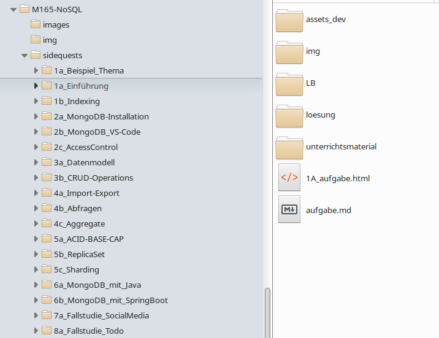

# OpenOLAT Sidequest Importer

## Summary

Proof of concept - a Python script to create courses in OpenOlat, and add existing HTML pages from a local directory to them.

## Howto

Username, password and URL for your OpenOlat instance must be set up in a *.env* file:

```
OLAT_USER=administrator
PASSWD=yourpasswd
URL="http://localhost:8080/OpenOLAT/restapi/repo/courses/"
```

Entry point is `course_migrator.py`. Adopt Course descriptions within.

The following directory structure is expected (WISS standard as of 2024):



## OpenOLAT Version

This script works with OpenOlat 20.1a
